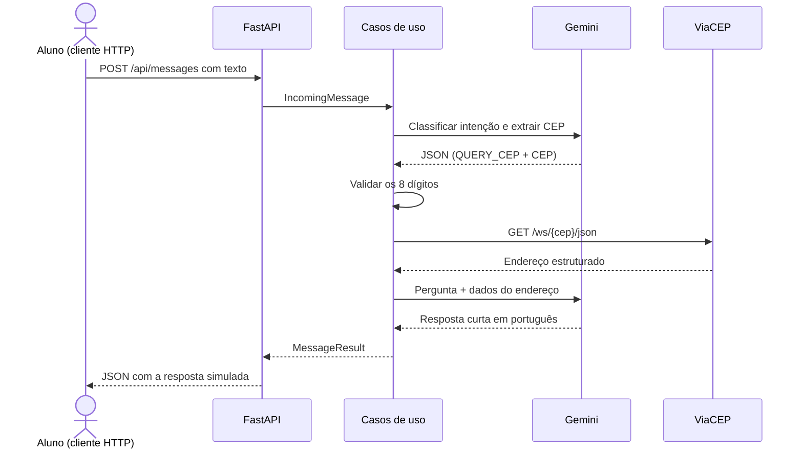

# Assistente de CEP em Python: API + Gemini + ViaCEP

Este projeto didático mostra como uma mensagem que **simula** ter vindo do WhatsApp percorre uma API, consulta uma fonte externa de dados e recebe uma resposta em linguagem natural criada pelo Gemini.

Não há integração real com WhatsApp ou Meta. O remetente e o identificador da mensagem são campos de um `POST` HTTP, e a resposta aparece diretamente no JSON retornado pela API.

## O fluxo completo



O ponto mais importante é que o Gemini **não consulta o ViaCEP**. O modelo interpreta e redige; o código valida o CEP, escolhe a integração e controla os dados. Assim, um fato verificável vem da API de dados, não da memória probabilística do modelo.

## Organização do código

O exemplo usa uma arquitetura hexagonal leve. As regras centrais dependem de contratos (`Protocol`), não de FastAPI, HTTPX, Gemini ou ViaCEP.

```text
app/
├── main.py                  monta as dependências e cria a aplicação FastAPI
├── api.py                   recebe a mensagem HTTP simulada
├── config.py                lê as variáveis de ambiente
├── domain/
│   ├── models.py            objetos do domínio e ações possíveis
│   └── ports.py             contratos para LLM, consulta e idempotência
├── application/
│   └── services.py          orquestra Gemini → validação → ViaCEP → Gemini
└── adapters/
    ├── gemini.py            chama a Gemini Developer API por REST
    ├── viacep.py            consulta e converte a resposta do ViaCEP
    └── memory.py            registra IDs já processados em memória
tests/                       testes com dublês e HTTP simulado
```

### O papel de cada parte

- `api.py` valida o JSON de entrada com Pydantic e o converte em `IncomingMessage`.
- `HandleIncomingMessageService` evita processar duas vezes o mesmo `message_id`.
- `AnswerQuestionService` contém o fluxo de negócio e valida o CEP antes da API externa.
- `GeminiAdapter.analyze` pede uma saída JSON com `QUERY_CEP`, `HELP` ou `UNSUPPORTED`.
- `ViaCepAdapter` transforma os campos em português do ViaCEP em um objeto `Address`.
- `GeminiAdapter.compose_address_response` fornece os dados encontrados ao modelo para redigir até três frases.
- `main.py` conecta implementações concretas às portas. Nos testes, elas são trocadas por dublês sem rede.

## Pré-requisitos

- Python 3.11 ou mais recente;
- uma chave da Gemini Developer API criada no [Google AI Studio](https://aistudio.google.com/app/apikey).

Não coloque a chave no código nem faça commit do arquivo `.env`.

## Executar localmente

Crie e ative um ambiente virtual.

Linux ou macOS:

```bash
python -m venv .venv
source .venv/bin/activate
python -m pip install -r requirements-dev.txt
export GEMINI_API_KEY="sua-chave"
uvicorn app.main:app --reload --port 8080
```

PowerShell:

```powershell
python -m venv .venv
.\.venv\Scripts\Activate.ps1
python -m pip install -r requirements-dev.txt
$env:GEMINI_API_KEY="sua-chave"
uvicorn app.main:app --reload --port 8080
```

Git Bash no Windows (a pasta de ativação é `Scripts`, não `bin`):

```bash
python -m venv .venv
source .venv/Scripts/activate
python -m pip install -r requirements-dev.txt
export GEMINI_API_KEY="sua-chave"
python -m uvicorn app.main:app --reload --port 8080
```

O modelo padrão é `gemini-3.5-flash-lite`. Ele pode ser alterado por `GEMINI_MODEL`, e o timeout das chamadas HTTP por `HTTP_TIMEOUT_SECONDS`. Veja os valores em `.env.example`.

Com a aplicação em execução, abra `http://localhost:8080/docs` para usar a interface interativa do FastAPI.

Se a API devolver `502`, leia o campo `detail`: ele informa o status recebido do Gemini. Erros `401` ou `403` normalmente indicam chave inválida, bloqueada ou sem permissão; `404` indica modelo indisponível; `429` indica limite de uso. Gere a chave no Google AI Studio, mantenha-a somente na variável de ambiente e reinicie o Uvicorn depois de trocá-la.

## Simular uma mensagem

Envie um identificador único, um nome ou telefone fictício e o texto. Esses dados apenas simulam o formato mínimo de uma mensagem; nada é enviado ao WhatsApp.

Bash:

```bash
curl -X POST http://localhost:8080/api/messages \
  -H "Content-Type: application/json" \
  -d '{
    "message_id": "msg-001",
    "sender": "aluno-01",
    "text": "Onde fica o CEP 85801-000?"
  }'
```

PowerShell:

```powershell
$body = @{
    message_id = "msg-001"
    sender = "aluno-01"
    text = "Onde fica o CEP 85801-000?"
} | ConvertTo-Json

Invoke-RestMethod `
    -Method Post `
    -Uri http://localhost:8080/api/messages `
    -ContentType "application/json" `
    -Body $body
```

Uma resposta típica tem este formato:

```json
{
  "message_id": "msg-001",
  "recipient": "aluno-01",
  "status": "processed",
  "answer": "O CEP 85801-000 corresponde a ..."
}
```

Envie também `"Oi, o que você faz?"` e uma pergunta fora do tema para observar as outras decisões do classificador. Se repetir o mesmo `message_id`, a resposta terá `status: "duplicate"` e não fará novas chamadas externas. Como esse registro fica somente na memória, ele é apagado quando o processo reinicia.

## Executar os testes

```bash
pytest -q
```

Os testes não precisam de chave nem de internet. Eles verificam a orquestração, a rejeição de CEP inválido, a deduplicação e o mapeamento das respostas HTTP usando `httpx.MockTransport`.

Também é possível validar apenas a sintaxe de todos os módulos:

```bash
python -m compileall -q app tests
```

## Executar com Docker

Copie `.env.example` para `.env`, preencha `GEMINI_API_KEY` e execute:

```bash
docker compose up --build
```

Teste a aplicação em `http://localhost:8080/docs` ou consulte a saúde:

```bash
curl http://localhost:8080/health
```

## Por que duas chamadas ao Gemini?

A primeira chamada converte linguagem natural em uma decisão estruturada. A segunda converte dados estruturados e confiáveis em uma resposta natural. Entre elas, o código mantém o controle: valida o CEP e chama somente uma integração permitida.

Esse desenho também facilita testes. `AnswerQuestionService` pode receber um modelo e uma consulta falsos, então suas decisões são verificadas sem gastar tokens nem depender da rede.

## Limitações intencionais

- A API responde de forma síncrona; um webhook real normalmente confirmaria o recebimento rapidamente e continuaria o trabalho em uma fila.
- A deduplicação é local e em memória. Em múltiplas instâncias, use Redis ou um banco com chave única.
- Não há histórico de conversa, autenticação, retry, circuit breaker ou observabilidade completa.
- Mensagem e dados externos são delimitados nos prompts, mas uma aplicação real ainda deve avaliar prompt injection, privacidade, custos e limites de uso.
- O ViaCEP cobre apenas CEPs brasileiros. Outra fonte pode ser ligada à mesma porta sem mudar o caso de uso.

## Próximos exercícios

1. Troque o ViaCEP por uma API relacionada ao problema do seu grupo.
2. Acrescente uma segunda ação e compare classificação estruturada com function calling.
3. Implemente persistência da deduplicação.
4. Adicione métricas de latência das duas APIs e contagem de erros por tipo.
5. Crie testes para timeout, resposta malformada e tentativa de prompt injection.

## Referências

- [Gemini API: primeiros passos](https://ai.google.dev/gemini-api/docs/get-started)
- [Gemini API: saída estruturada](https://ai.google.dev/gemini-api/docs/structured-output)
- [ViaCEP](https://viacep.com.br/)
